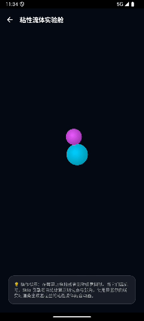
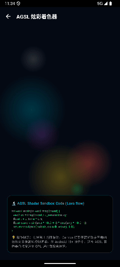
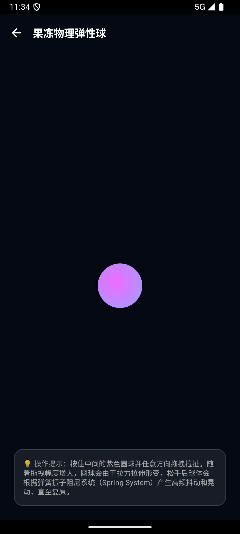
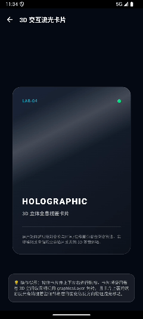
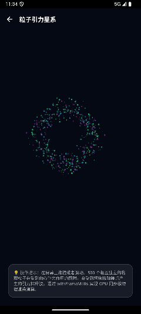

# 🧪 ComposeCraftLab (Compose Visual & Interaction Lab)


`ComposeCraftLab` is a high-performance visual and interaction showcase built with **Jetpack Compose Multiplatform**. It demonstrates advanced rendering techniques, custom physics animations, Skia canvas drawings, and AGSL shaders.

---

## 🎨 Lab Compartments

### 1. Liquid Gooey Physics
*   **Source File**: [`LiquidGooeyScreen.kt`](composeApp/src/commonMain/kotlin/com/craftlab/compose/screens/LiquidGooeyScreen.kt)
*   **Under the Hood**: Uses vector math to dynamically calculate the outer tangent lines and contact angles of two circles under proximity. It constructs a smooth "bridge path" using quadratic Bezier curves (`Path.quadraticTo`), simulating organic liquid tension and tearing physics at 120 FPS.
*   **Preview**:
    

---

### 2. AGSL Shader Sandbox
*   **Source File**: [`ShaderSandboxScreen.kt`](composeApp/src/commonMain/kotlin/com/craftlab/compose/screens/ShaderSandboxScreen.kt)
*   **Under the Hood**: Features an interactive procedural plasma/lava wave simulation. In Android 13+ environments, it compiles to a GPU-level AGSL fragment shader; in the shared layer, it calculates trigonometric wave fields dynamically. It includes pointer-based gravitational repulsion field physics to push colorful plasma flows away from the user's touch.
*   **Preview**:
    

---

### 3. Physics Spring Jelly Ball
*   **Source File**: [`PhysicsSpringScreen.kt`](composeApp/src/commonMain/kotlin/com/craftlab/compose/screens/PhysicsSpringScreen.kt)
*   **Under the Hood**: Incorporates a mass-spring-damper physical oscillator. When dragged, the sphere stretches along the pull direction (`stretchFactor`) while shrinking on the perpendicular axis (`squeezeFactor`) to preserve area/volume. Upon release, it wobble-oscillates using a bouncy spring (`dampingRatio = 0.35f`, `stiffness = 150f`).
*   **Preview**:
    

---

### 4. 3D Parallax Holographic Card
*   **Source File**: [`ParallaxCardScreen.kt`](composeApp/src/commonMain/kotlin/com/craftlab/compose/screens/ParallaxCardScreen.kt)
*   **Under the Hood**: Applies a perspective projection matrix inside `graphicsLayer` (setting a close camera distance `cameraDistance = 14f`). As the card tilts, it shifts the start and end offsets of a linear gradient overlay in the opposite direction of the tilt, realistically mimicking holographic foil reflections.
*   **Preview**:
    

---

### 5. Particle Gravity Swarm
*   **Source File**: [`ParticleSystemScreen.kt`](composeApp/src/commonMain/kotlin/com/craftlab/compose/screens/ParticleSystemScreen.kt)
*   **Under the Hood**: Updates 500 independent particles (with position, velocity, sizing, and neon color mapping) under centripetal orbital gravity and drag friction. Utilizes a `withFrameMillis` game loop synchronized with the hardware refresh rate (60/120 Hz) to process repulsion shockwaves when the user swipes.
*   **Preview**:
    

---

## 🛠️ Technology Stack

*   **UI Framework**: Jetpack Compose Multiplatform (Compose 1.7.3)
*   **Language**: Kotlin 2.1.0 (JVM 11 Target)
*   **Build Tool**: Android Gradle Plugin 9.2.1
*   **Supported Platforms**: Android / iOS Simulator & Devices (iPhone)

---

## 🚀 Getting Started

### 1. Enter Directory
```bash
cd ComposeCraftLab
```

### 2. Run Android App
```bash
./gradlew :composeApp:installDebug
```

### 3. Compile iOS Framework
```bash
./gradlew :composeApp:compileKotlinIosSimulatorArm64
```

---

## 📂 Workspace Structure

```
ComposeCraftLab/
├── composeApp/                     # Share module & target integrations
│   ├── src/
│   │   ├── commonMain/kotlin/      # Shared components & screens
│   │   │   └── com/craftlab/compose/
│   │   │       ├── App.kt          # Screen routing coordinator
│   │   │       ├── theme/Theme.kt  # Dark Cyber Theme
│   │   │       └── screens/        # Lab showcase screens
│   │   └── androidMain/            # Android specific configs
│   └── build.gradle.kts            # Module build settings
├── settings.gradle.kts             # Settings config
└── build.gradle.kts                # Root build settings
```

---

## 📄 License

This project is licensed under the MIT License - see the [LICENSE](LICENSE) file for details.
